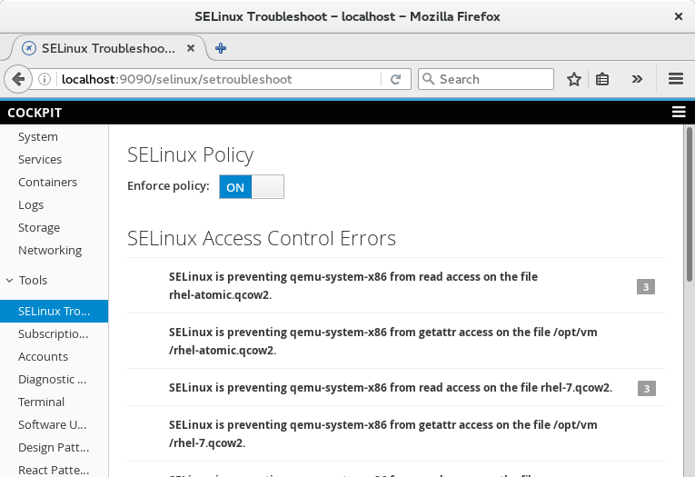

Title: Cockpit 0.111
Date: 2016-06-26 09:00
Tags: cockpit, linux, technical
Slug: cockpit-0.111
Category: release
Summary: Cockpit releases every week. Here's highlights from 0.107 through 0.111.

Cockpit is the [modern Linux admin interface](http://cockpit-project.org/). There's a new release every week, although it's been a while since the release notes were posted. Here are the highlights from this weeks 0.107 through 0.111 releases.

### SELinux enforcing policy

You can now temporarily disable SELinux enforcing mode from the SELinux troubleshooting
dashboard. This is useful when diagnosing permission issues that you might think are
SELinux related.

### Stable Javascript API

Cockpit now has a [stable Javascript API](http://cockpit-project.org/guide/latest/api-base1.html)
for components or plugins to build off of. Various unstable portions were removed from the
base1 package in preparation for this. There's more work going on to help make it easy to build
out of tree components or plugins.

### GlusterFS in Kubernetes Dashboard

The [Kubernetes](http://kubernetes.io/) dashboard now lists [Gluster](http://gluster.org/)
volumes in the dashboard, lets you configure them for pods to use.

### Kubernetes pending Persistent Volume Claims

The [Kubernetes](http://kubernetes.io/) dashboard lists pods which have
outstanding volume claims, and then allows you to fulfill those claims
by creating appropriate persistent volumes.

### From the Future

Marius [has worked on](https://github.com/cockpit-project/cockpit/pull/4571) adding support
for Linux [network teaming](http://libteam.org/) to the Cockpit admin interface. Teaming
is a better more coherent way of building a network bond.

### Try it out

Cockpit 0.111 is available now:

 * [For your Linux system](http://cockpit-project.org/running.html)
 * [Source Tarball](https://github.com/cockpit-project/cockpit/releases/tag/0.111)
 * [Fedora 24](https://bodhi.fedoraproject.org/updates/cockpit-0.111-1.fc24)
 * [COPR for Fedora 23, CentOS and RHEL](https://copr.fedoraproject.org/coprs/g/cockpit/cockpit-preview/)

