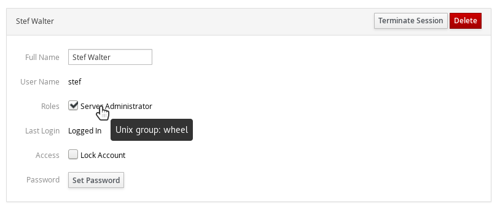

Title: Cockpit 120
Date: 2016-10-21 13:22
Tags: cockpit, linux, technical
Slug: cockpit-120
Category: release
Summary: Cockpit releases regularly. Here's highlights from 119 and 120

Cockpit is the [modern Linux admin interface](http://cockpit-project.org/). We release
regularly. Here are the release notes from versions 119 and 120.

You'll notice that we've dropped the ```0.x``` from the beginning of the
version numbers. This underscores the fact that Cockpit is stable. We've been
regularly releasing functionally stable releases for most of the last year.

### Expandable and Filterable Containers and Images

Lars reworked the Containers section of Cockpit. The various images and
containers are not expandable inline, and it's also easy to find a specific
image and container by using the filter bar to search for it.

Take a look:

<iframe width="853" height="480" src="https://www.youtube.com/embed/-huY6q7kcmU" frameborder="0" allowfullscreen></iframe>

### VM Configuration and Monitoring

Marek worked on a new interface in Cockpit for configuring and monitoring
virtual machines running on the current system. This has the ability to
grow into something like the desktop ```virt-manager``` tool.

It looks something like this:


### Unmanaged Network Devices

Cockpit now shows unmanaged network devices in its listing. You can't configure
them or do much with them, but their presence is acknowledged. This should make
troubleshooting non-standard configurations easier.

### Sidebar for Physical Volumes in a Volume Group

Marius added a sidebar that shows up on LVM groups or volumes, that shows
which physical devices are involved.

Here's an example:


### SSH connections are run in a separate process

When Cockpit connects to an additional server it uses SSH, much like
Ansible or other tools. We now launch a separate ```cockpit-ssh``` process
for each outgoing connection to another server.

This lets us isolate the involved code much better, providing security
benefits. But it also makes it possible to insert additional logic when
embedding Cockpit. It's possible to put in shims to lookup keys, single-sign-on
tokens or keytabs, and so on.


### Only connect to remote machines already known to Cockpit

When connecting to additional machines via SSH, Cockpit now refuses to
connect to machines it doesn't have a host key for. This tightens up
security and prevents certain reflection attacks.

### Fix bugs preventing Logs page from working in Firefox 49

The Logs section of Cockpit failed to function on Firefox 49. This
version includes a fix for that.

### Add tooltip describing group name in Roles list

When configuring local user accounts, one can assign various roles such
as 'Server Administrator' to the account. Cockpit now displays the Unix
user group that is involved in the role.



### From the future

Marius added support for NetworkManager checkpoints. This means that
while configuring network interfaces, if a change would cause Cockpit
to disconnect, then Cockpit can revert the change and retain connectivity
to the system.

This is similar to how a Linux Desktop asks you to click in a dialog
if you accept the new screen configuration. Except in the networking
case we can test the connectivity automatically.

### Try it out

Cockpit 120 is available now:

 * [For your Linux system](http://cockpit-project.org/running.html)
 * [Source Tarball](https://github.com/cockpit-project/cockpit/releases/tag/120)
 * [Fedora 25](https://bodhi.fedoraproject.org/updates/cockpit-120-1.fc25)
 * [COPR for Fedora, CentOS and RHEL](https://copr.fedoraproject.org/coprs/g/cockpit/cockpit-preview/)
