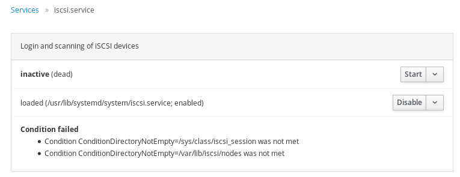
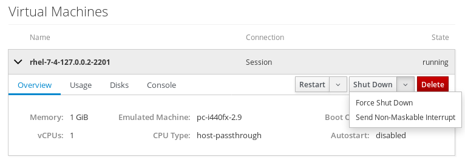

Cockpit is the [modern Linux admin interface](http://cockpit-project.org/). We release regularly.
Here are the release notes from versions 149 and 150.

### Add information about unmet conditions for systemd services

Systemd units can have conditions which must be met in order for the service to
start. Cockpit now shows unmet conditions in the details of a service, so that
users can see why a service is in active.

### Automatically enable and start newly created timers on the Services page

Cockpit allows the user to create custom systemd timers on the Services page,
to run commands at particular times or after boot. Previously they had to be
explicitly enabled and started to become effective; this now happens
automatically.

### Support Kubernetes authentication providers in kube config files

Some kubernetes deployments such as Google Compute Engine use Kubernetes
authentication providers so that they can automatically regenerate their access
token when needed. Cockpit now supports kube config files using this format.

### Support sending non-maskable interrupt to VMs

The Shut Down button on the Machines page got a new option "Send Non-Maskable
Interrupt". This normally does not trigger a reaction (other than a kernel
message), but the Linux kernel can be configured to react to this with a kernel
panic. This allows administrators to debug hung virtual machines.

### Support Dashboard installation into OSTree overlay

The cockpit-dashboard package can now be installed as package overlay into
rpm-ostree. This enables managing multiple remote servers through one Cockpit
instance on Atomic based systems.

### Clear cockpit cookie on logout

Previously, after logging out (explicitly or due to session timeout) it could
happen that revisiting a seen page would show a cached version instead of the
login page. This has now been fixed by properly clearing Cockpit's browser
cookie.

### Try it out

Cockpit 150 is available now:

 * [For your Linux system](http://cockpit-project.org/running.html)
 * [Source Tarball](https://github.com/cockpit-project/cockpit/releases/tag/150)
 * [Fedora 26](https://bodhi.fedoraproject.org/updates/cockpit-150-1.fc26)
